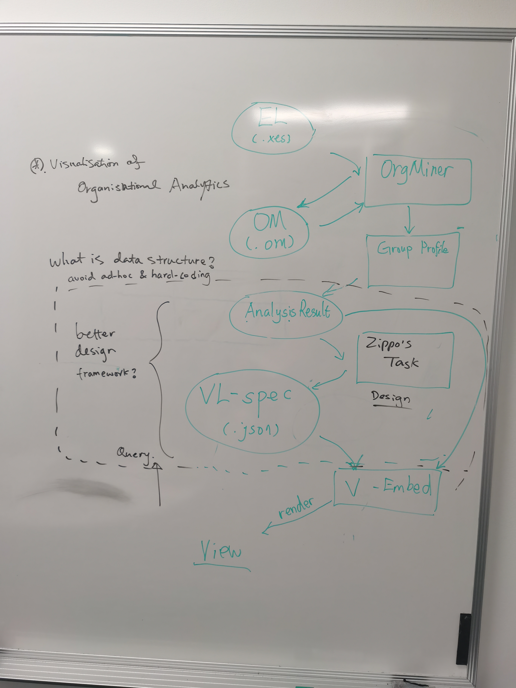

# Project Plan

## Main Task - OrgMiner 2.0 visualisation imporove

[1] **Get familiar and fix Errors**

[2] **Interactive User Interface**

- interactive user interface
- provision of user-centric explanations

[3] **Improve visualisation of Organisational View**

- Visualisation of discrepancy
- Explanation via diagnosis

## 2020/11/25 Update

### Task 1: Visualisation of Orgnisational Analytics

- Design the back-end framework for Orgnisational Analytics
- Modularise the process of generating vega-lite spec (JSON)
- Apply suitable data structure (avoid ad-hoc or hard=coding)

### Task 2: Improve visualisation of Organisational View

Explore `d3.js` to find a better way to visualise tree model.

Related link:
[Interactive Tree Diagram (D3v3) / Aaron Kyle Dennis / Observable (observablehq.com)](https://observablehq.com/@aaronkyle/interactive-tree-diagram-d3v3)

### Future Task: Explore Organizational Model Markup Language

Check this paper for more info:

> Song, M., & Van der Aalst, W. M. (2008). Towards comprehensive support for organizational mining. *Decision Support Systems, 46*(1), 300-317.
