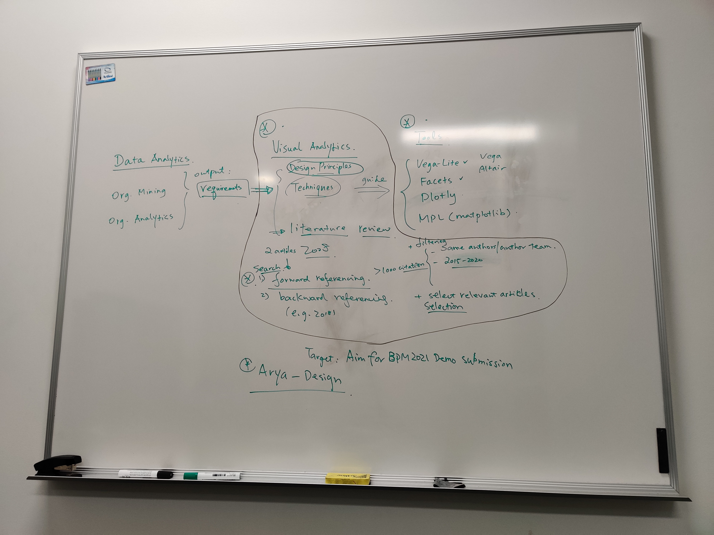

# Project Plan

## Main Task - OrgMiner 2.0 visualisation imporove

[1] **Get familiar and fix Errors**

[2] **Interactive User Interface**

- interactive user interface
- provision of user-centric explanations

[3] **Improve visualisation of Organisational View**

- Visualisation of discrepancy
- Explanation via diagnosis

## 2020/11/25 Update

### Task 1: Visualisation of Orgnisational Analytics

This picture will be replaced by a diagram later.

- Design the back-end framework for Orgnisational Analytics
- Modularise the process of generating vega-lite spec (JSON)
- Apply suitable data structure (avoid ad-hoc or hard=coding)

### Task 2: Improve visualisation of Organisational View

- Explore `d3.js` to find a better way to visualise tree model.

Related link:
[Interactive Tree Diagram (D3v3) / Aaron Kyle Dennis / Observable (observablehq.com)](https://observablehq.com/@aaronkyle/interactive-tree-diagram-d3v3)

### Future Task: Explore Organizational Model Markup Language

- Explore the possible of using unified data structure to store organizational model data

Check this paper for more info:

> Song, M., & Van der Aalst, W. M. (2008). Towards comprehensive support for organizational mining. *Decision Support Systems, 46*(1), 300-317. [https://doi.org/10.1016/j.dss.2008.07.002](https://doi.org/10.1016/j.dss.2008.07.002)

## 2020/12/07 Update

### Scope of the visualisation in Organisational Mining

|       Data Analytic      |      =>      |  Visual Analytic |   =>  |    Tools   |
|:------------------------:|:------------:|:----------------:|:-----:|:----------:|
|   Organisational Mining  | requirements | Design Principle | guide |    Vega    |
| Organisational Analytics |              |    Techniques    |       |  Vega-Lite |
|                          |              |                  |       | Matplotlib |
|                          |              |                  |       |   Seaborn  |
|                          |              |                  |       |   Altair   |
|                          |              |                  |       |   Plotly   |
|                          |              |                  |       |   Facets   |

### Data Analytic

Data Analytic should be the main part of research in Orgnasational Mining. It would provide requirements for Visual Analytic.

For my VRES and Honours study, this part will be processed by Roy.

### Visual Analytic **

Visual Analytic will combine current **design principle** and **techniques** with requirements from Data Analytic as new specifications to guide the design and develop visualisation tools.

#### Design Principle

Design Principle - fundamental pieces of advice

The start points of Visual Analytic for Organisational Analytic are:

> Keim, D., Andrienko, G., Fekete, J. D., Görg, C., Kohlhammer, J., & Melançon, G. (2008). Visual analytics: Definition, process, and challenges. In Information visualization (pp. 154-175). Springer, Berlin, Heidelberg. [https://doi.org/10.1007/978-3-540-70956-5_7](https://doi.org/10.1007/978-3-540-70956-5_7)

> Keim D.A., Mansmann F., Schneidewind J., Thomas J., Ziegler H. (2008) Visual Analytics: Scope and Challenges. In: Simoff S.J., Böhlen M.H., Mazeika A. (eds) Visual Data Mining. Lecture Notes in Computer Science, vol 4404. Springer, Berlin, Heidelberg. [https://doi.org/10.1007/978-3-540-71080-6_6](https://doi.org/10.1007/978-3-540-71080-6_6)

#### Method: Forward Referencing

The explaination of Forward Referencing can be found in this [link](https://libguides.fau.edu/c.php?g=325509&p=2182112).

Detail steps:

1. **Search**: From the start points (the previous articles), search all the articles which cited the original articles. Numbers: more than 1000
2. **Filter**: By years (after 2015), by authors (or teams), etc. Numbers: 200-300
3. **Select**: Read title, abstruct, introduction and conclusion of each article to find the relevant articles. Numbers: 20-30

### Tools **

Use specifications from Visual Analytic to judge which type of visualisation tool is fittest for Organisational Analytic.

Tools we know:

From High Level to Low Level

- Facets
- Vega, Vega-Lite, Seaborn, Plotly
- Matplotlib, d3.js

### Target of project

BPM 2021 Demo (finish before June 2021)

### Task for next period

1. Summary for Design Principle
2. Compare the rest of visualisation tools
3. Draw the data flow chart for Arya Back-End

### Meeting Draft

