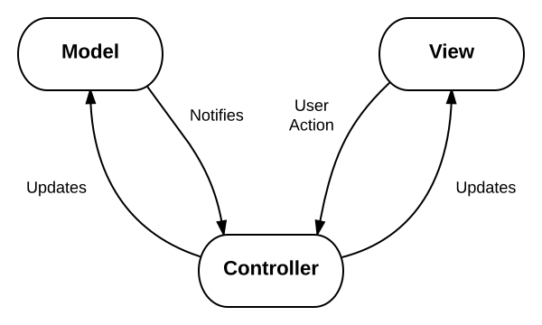

# Technical Description for OrgMiner-Arya

## 1. Technical Review

### [1] MVC Framework ([source](https://en.wikipedia.org/wiki/Model%E2%80%93view%E2%80%93controller))

Model–view–controller (MVC) is a software design pattern commonly used for developing user interfaces that divides the related program logic into three interconnected elements. This is done to separate internal representations of information from the ways information is presented to and accepted from the user.

#### Interactions Betweeen Components

The MVC design pattern also defines interactions between components, as we can see in the following diagram:



- The **model** stores data that is retrieved according to commands from the **controller**
- The **view** generates output for the user based on changes in the **model**
- The **controller** acts on both **model** and **view**; it sends commands to the **model** to update its state and to the **view** to change information presented to users

### [2] Flask ([source](https://flask.palletsprojects.com/en/1.1.x/))

Flask is a lightweight web framework for Python. Here will introduce some key methods in Flask.

#### Routing

Flask use the route() decorator to bind a function to a URL. For example,

```python
@app.route('/')
def index():
    return 'Index Page'

@app.route('/hello')
def hello():
    return 'Hello, World'
```

#### HTTP Methods

By default, a route only answers to GET requests. It can use the methods argument of the route() decorator to handle different HTTP methods. For example,

```python
from flask import request

@app.route('/login', methods=['GET', 'POST'])
def login():
    if request.method == 'POST':
        return do_the_login()
    else:
        return show_the_login_form()
```

#### Rendering Templates

To render a template you can use the render_template() method. All you have to do is provide the name of the template and the variables you want to pass to the template engine as keyword arguments. Flask will look for templates in the `templates` folder. Here’s a simple example of how to render a template:

```python
from flask import render_template

@app.route('/hello/')
@app.route('/hello/<name>')
def hello(name=None):
    return render_template('hello.html', name=name)
```

#### Blueprint

A **Blueprint** is a way to organize a group of related views and other code. Rather than registering views and other code directly with an application, they are registered with a blueprint. Then the blueprint is registered with the application when it is available in the factory function.

```python
from flask import Blueprint

bp = Blueprint('auth', __name__, url_prefix='/auth')
```

Import and register the blueprint from the factory using `app.register_blueprint()`. Place the new code at the end of the factory function before returning the app.

```python
def create_app():
    app = ...
    # existing code omitted

    from . import auth
    app.register_blueprint(auth.bp)

    return app
```

## 2. Components analysis for OrgMiner-Arya

### [1] How OrgMiner-Arya collect and analyse data

OrgMiner-Arya do not use normal database to store the data. It requires users to upload event log files to the website. In this part, it will mainly discuss how OrgMiner-Arya process these data by using related classes in `arya/forms.py` and functions in `arya/discover.py`.

#### Check File Extension

This class is to make sure that users upload data with right file extension.

```python
# forms.py

from flask_wtf import FlaskForm
from flask_wtf.file import FileField, FileRequired, FileAllowed
import wtforms

class LogUploadForm(FlaskForm):
    f_log = FileField(
        u'Select an event log file with one of the extensions below',
        validators=[
            FileRequired(),
            FileAllowed(['xes'],
                'Incompatible file extension. Please check again')
        ]
    )
    submit = wtforms.SubmitField(
        u'Upload'
    )
```

#### Configure Discovery Approach

This class is to create an approach configuration form by WTForms.

```python
# forms.py

class DiscoveryConfigForm(MethodConfigForm):
    class Form(FlaskForm):
        # Phase 1 methods and options
        method_learn_exec_modes = wtforms.SelectField(
            u'Phase 1. Learn execution modes',
            choices=[
                (None, '(select a method)'),
                ('direct_groupby.ATonlyMiner', 'ATonly'),
                ('direct_groupby.FullMiner', 'CT+AT+TT (case attribute)')
            ],
            validators=[wtforms.validators.InputRequired()],
            render_kw={
                'config_type': 'method',
                'config_id': 'learn_exec_modes',
            }
        )
    # existing code omitted
```

#### Process data

This function is to analyse uploaded xes files and save processed data to `exec_mode_miner` and `om`.

```python
# discovery.py

def _discover_org_model(
    path_server_event_log, filetype_server_event_log, configs):

    # existing code omitted

    return om, exec_mode_miner
```

Then, `exec_mode_miner` and `om` will be stored in `session['exec_mode_miner']` and `session['org_model']` for visualization.

```python
# discovery.py

@bp.route('/submit_discover_org_model', methods=['POST'])
def discover_org_model():

    # existing code omitted

        session['exec_mode_miner'] = exec_mode_miner
        session['org_model'] = om

        return redirect(url_for('visualization.visualize'))
```

### [2] How OrgMiner-Arya visualise the data

#### Show Global Conformance

Read data from `session['org_model']` and `session['exec_mode_miner']` to json file; then, calculate global conformance data.

```python
# visualization.py

@bp.route('/visualize', methods=['GET'])
def visualize():
    # retrieve organizational model
    om = session['org_model']

    # generate visualization data
    data_org_model = _draw_org_model(om)

    # calculate global conformance data
    el = session['event_log']
    exec_mode_miner = session['exec_mode_miner']
    rl = exec_mode_miner.derive_resource_log(el)

    from orgminer.Evaluation.l2m.conformance import fitness, precision
    fitness = fitness(rl, om)
    precision = precision(rl, om)
    f1_score = 2 * (fitness * precision) / (fitness + precision)
    return render_template('visualize.html',
        DELIM=DELIM,
        data_org_model=data_org_model,
        fitness_org_model=fitness,
        precision_org_model=precision,
        f1_score_org_model=f1_score,
    )
```

Show the results on the top-right side of visualize page.

```html
<div class="card-body font-weight-bold bg-light py-1 px-0">
    <h5 class="score-card-val">
        {{ '{:.3f}'.format(fitness_org_model) }}
    </h5>
</div>
<div class="card-footer small text-secondary border-0 py-0 px-0">
    Fitness
</div>
```

#### Organizational Model View

Organizational Model View uses D3.js to create a SVG tree-like model.

```javascript
// visualize.html

/* Graph renderers */
function renderOrgM(nodeList, edgeList) {
    var dotSrcString = df.compileDotString(nodeList, edgeList);
    //console.log("Renderer invoked for source:\n" + dotSrcString);

    const renderOptions = {
        "engine": "dot",
        "width": $("#canvas-org-m").width(),
        "scale": 1.0,
        "zoomScaleExtent": [0.5, 3]
    };
    d3.select("#canvas-org-m").graphviz(renderOptions)
        .transition(normal_transition)
        .renderDot(dotSrcString, function() {
            waiter.attachSVGListeners(
                [nodeList, edgeList],
                d3.select("#canvas-org-m").select(".graph")
            );

            // post-rendering config
            d3.select("div#canvas-org-m > svg")
                .on("dblclick.zoom", null);
        });
}
```

`Waiter` is used to add event listener to each node and highlight the chosen node.

```javascript
// arya-controller.js

// class for handling all interactions
class Waiter {
    // existing code omitted

    attachSVGListeners(elemList, graph) {
        var self = this;

        // console.log(graph);
        // search for all node elements in an svg graph and attach listeners
        graph.selectAll(".node").selectAll(function() {
            var nodeType = d3.select(this).
                select("title").text().split(delim)[0];

            switch(nodeType) {
                case "group":
                    self.attachGroupNodeListeners(
                        elemList, d3.select(this));
                    break;
                case "resource":
                    self.attachResourceNodeListeners(
                        elemList, d3.select(this));
                    break;
                case "mode":
                    self.attachModeNodeListeners(
                        elemList, d3.select(this));
                    break;
                default:
                    // do nothing
            }
        });
    }

    attachGroupNodeListeners(elemList, groupNode) {
        // existing code omitted
    }

    attachResourceNodeListeners(elemList, node) {
        // not used
    }

    attachModeNodeListeners(elemList, modeNode) {
        // existing code omitted
    }

}
```

`ModeTree` is used to initialise nodes for tree model. `ct`- case_type, `at` - activity_type, `tt` - time_type

```javascript
// arya-data.js

// class for organizing the execution mode tree
class ModeTree {
    // existing code omitted
}

// class for handling all data elements
class DataFactory {
    // existing code omitted
}
```

#### Local Diagnostics

```javascript
// arya-controller.js

// class for handling the display of statistics on the panel
class ScoreCard {
    // existing code omitted
}
```

```javascript
// visualize.html

// render Member Contribution graph
function renderLDMemContr(data) {
    // existing code omitted
}
```
