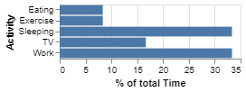
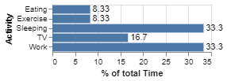
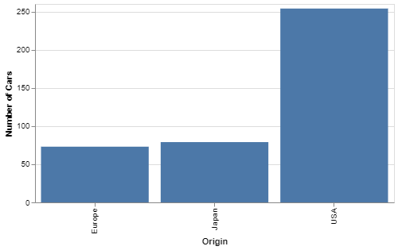

# Visualisation Methods

## 1. D3.js

### [1] What is D3.js

[D3.js](https://d3js.org/) is a **JavaScript** library for manipulating documents based on data. D3 helps you bring data to life using HTML, SVG, and CSS. D3’s emphasis on web standards gives you the full capabilities of modern browsers without tying yourself to a proprietary framework, combining powerful visualization components and a data-driven approach to DOM manipulation.

## 2. Vega

### [1] What is Vega

[Vega](https://vega.github.io/vega/) is a visualization grammar, a declarative language for creating, saving, and sharing interactive visualization designs. With Vega, you can describe the visual appearance and interactive behavior of a visualization in a **JSON** format, and generate web-based views using Canvas or SVG.

### [2] Vega and D3.js ([source](https://vega.github.io/vega/about/vega-and-d3/))

Comparing with D3.js, Vega:

- Support customizable designs.
- Make visualizations more reusable and shareable.
- Enable programmatic generation of visualizations.
- Improve performance and platform flexibility.

### [3] Config about the view for Vega

Need to be attention next week

## 3. Vega-Lite

### [1] Different from Vega

[Vega-Lite](https://vega.github.io/vega-lite/) is a concise language for rapidly creating interactive visualizations. Vega-Lite specifications compile to full-blown Vega specifications. Though expressive and performant, Vega can still require verbose specifications: control flow is handled by the model, but the logic of event and data processing must be explicitly provided. As a result, Vega is not an ideal language for people to quickly author interactive plots in the midst of an analysis session. Vega-Lite focuses on rapid creation of common statistical graphics. Vega-Lite specifications are typically an order-of-magnitude smaller than corresponding Vega specifications. Compared to existing high-level grammars, Vega-Lite includes novel constructs for interaction techniques and multi-view displays.

### [2] Some Examples

#### Inline Data


Code:

```json
{
    "$schema": "https://vega.github.io/schema/vega-lite/v4.json",
    "data": {
        "values": [
            {"a": "C", "b": 2}, {"a": "C", "b": 7}, {"a": "C", "b": 4},
            {"a": "D", "b": 1}, {"a": "D", "b": 2}, {"a": "D", "b": 6},
            {"a": "E", "b": 8}, {"a": "E", "b": 4}, {"a": "E", "b": 7}
            ]
    },
    "mark": "bar",
    "encoding": {
        "y": {"field": "a", "type": "nominal"},
        "x": {
            "aggregate": "average", "field": "b", "type": "quantitative",
            "title": "Mean of b"
        }
    }
}
```

#### JSON by url


```json
{
    "$schema": "https://vega.github.io/schema/vega-lite/v4.json",
    "data": {
        "url": "https://raw.githubusercontent.com/vega/vega/master/docs/data/cars.json"
    },
    "transform": [
        {
        "filter": {"field": "Cylinders", "lte": "5"}
        }
    ],
    "mark": "bar",
    "encoding": {
        "x": {"field": "Cylinders", "type": "quantitative"},
        "y": {"field": "Acceleration", "type": "quantitative"},
        "size": {"value": 20}
    }
}
```

The View-level `transform` object is an array of objects describing transformations.

#### Embed in HTML

To show Vega-Lite in websites, it could use Vega-Embed to create a DOM element for visualisation.

Use a content delivery network (CDN) to get the script.

```html
<script src="https://cdn.jsdelivr.net/npm/vega@5"></script>
<script src="https://cdn.jsdelivr.net/npm/vega-lite@4"></script>
<script src="https://cdn.jsdelivr.net/npm/vega-embed@6"></script>
```
  
Here is the place for display the visualisation in HTML.

```html
<div id="visualisation"></div>
```

Then input Vega-Lite code in JavaScript.

```javascript
var vegaLiteCode = {
    // existing code omitted
};
```

Use Vega-Embed’s provided function to embed the code.

```javascript
// More argument info at https://github.com/vega/vega-embed
vegaEmbed('#visualisation', vegaLiteCode);
```

Here is an example by embdding the provious chart.

<iframe
  src="http://127.0.0.1:5500/Technical%20Description/data/vega-lite_embed.html"
  style="width:100%; height:270px;"
></iframe>

#### Vega-Lite Theme Configuration

`Config` object lists configuration properties of a visualization for creating a consistent theme.

```json
{
    "config": {
        // set background color
        "background": "#f8f9fa",

        "axis": {
            // disable grid
            "grid": false,

            //
        }
    }
}
```

#### Transform

`transform` object is an array of objects describing transformations.



```json
{
    "$schema": "https://vega.github.io/schema/vega-lite/v4.json",
    "description": "A bar graph showing what activites consume what percentage of the day.",
    "data": {
        "values": [
        {"Activity": "Sleeping", "Time": 8},
        {"Activity": "Eating", "Time": 2},
        {"Activity": "TV", "Time": 4},
        {"Activity": "Work", "Time": 8},
        {"Activity": "Exercise", "Time": 2}
        ]
    },
    "transform": [
        {"joinaggregate": [{"op": "sum", "field": "Time", "as": "TotalTime"}]},
        {"calculate": "datum.Time/datum.TotalTime * 100", "as": "PercentOfTotal"}
    ],
    "height": {"step": 12},
    "mark": "bar",
    "encoding": {
        "x": {
        "field": "PercentOfTotal",
        "type": "quantitative",
        "title": "% of total Time"
        },
        "y": {"field": "Activity", "type": "nominal"}
    }
}
```

#### Layer



```json
{
    "layer": [{
        "mark": "bar"
    }, {
        "mark": {
            "type": "text",
            "align": "left",
            "baseline": "middle",
            "dx": 3
        },
        "encoding": {
            "text": {"field": "PercentOfTotal", "type": "quantitative", "format": ".3"}
        }
    }]
}
```

#### Specifying Responsive Width and Height by Container ([source](https://vega.github.io/vega-lite/docs/size.html#specifying-responsive-width-and-height))

You can set the top-level `width` or `height` properties to `"container"` to indicate that the width or height of the plot should be the same as its surrounding container. The `width` and `height` can be set independently, for example, you can have a responsive `width` and a fixed `height` by setting width to `"container"` and `height` to a number.

After setting `width` or `height` to `"container"`, you need to ensure that the container’s width or height is determined outside the plot. For example, the container can be a `<div>` element that has style `width: 100%; height: 300px`. When the container is not available or its size is not defined (e.g., in server-side rendering), the default width and height are `config.view.continuousWidth` and `config.view.continuousHeight`, respectively.

Limitations:

- This responsive mode is available only for single view or layer specifications.
- Vega listens to the `window.resize` event to update plot size from container size. This should cover many use cases. However, if you change the container size programmatically (e.g., you build a custom divider view), you’ll need to trigger `window.resize` manually. In a modern browser, you can do: `window.dispatchEvent(new Event('resize'));`.

For example,



```json
{
  "width": "container",
  "height": 250,
  "data": {"url": "data/cars.json"},
  "mark": "bar",
  "encoding": {
    "x": {"field": "Origin"},
    "y": {"aggregate": "count", "title": "Number of Cars"}
  }
}
```